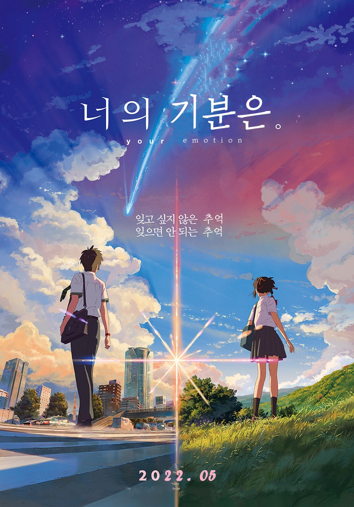
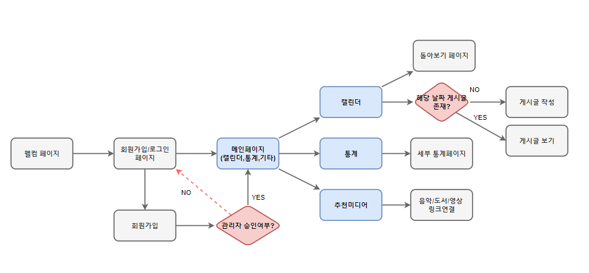
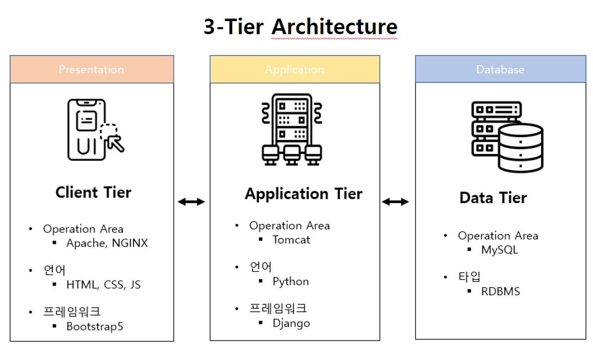
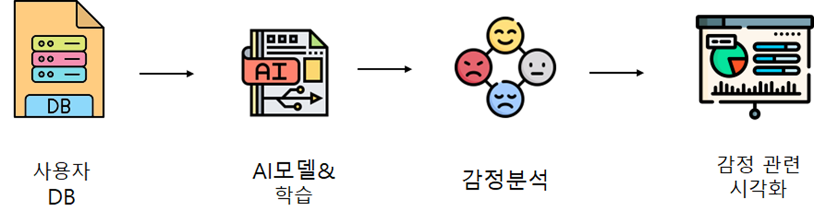
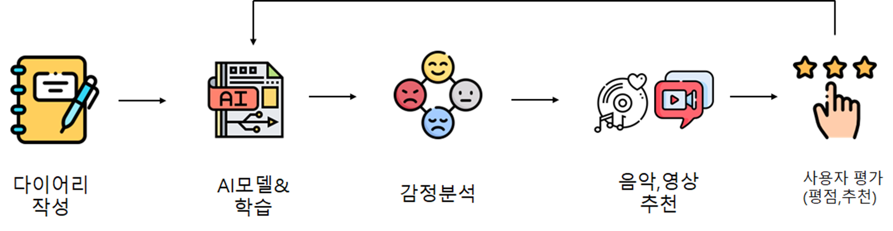
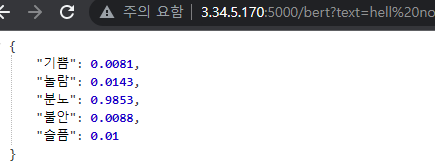

# Your-Feelings

# 로고

## 조원 소개
- AI수도권 1조 [01조]
> 전현근(조장)
> 이대용
> 천명철
> 편승희
> 홍지의

## 선정배경 
- COVID-19로 재택근무와 비대면 수업이 장기화되었다. 그로 인해 2030 청년들의 우울감이 증가하였고 일명 “코로나 블루 현상” 이 급증하였다. 이를 해소하기 위하여 새로운 동기 부여 혹은 자극을 제공할 수 있는 플랫폼의 필요성이 증가하였고 다이어리 작성을 통해 사용자의 감정을 파악하고 도움이 될 만한 컨텐츠를 제공하고자 한다. 

## 대상 
- 코로나 블루를 겪고 있는 사람 혹은 다이어리를 자주 작성하는 사람 

## 기대효과 

- 일기를 통한 감정 정리와 감정 분석을 토대로 추천이 된 컨텐츠를 통해 사용자가 우울감에서 벗어날 수 있도록 함 

- 감정 분석의 통계로 혹시 우울한 날들이 너무 길면 스스로 상담과 같은 전문적인 도움을 요청할 수 있는 지표가 될 수 있음 

- 코로나 블루 극복, 새로운 컨텐츠를 원하는 사용자, 결정하기 힘들어하는 사람들의 니즈 충족 

- SNS 연계/컨텐츠 추천 서비스와 관련하여 SNS, OTT 서비스 기업과 협업해 수익 창출도 가능하다.

  
- UI/UX 설계

## Service Flow

## 3 Tier Architecture

## 애플리케이션 흐름도

## API 사용법
### KOBERT  
url = '3.34.5.170:5000/kobert?text=' + 텍스트  
return type = dictionary  

### BERT
url = '3.34.5.170:5000/bert?text=' + 텍스트  
return type = dictionary  

version-1.0
